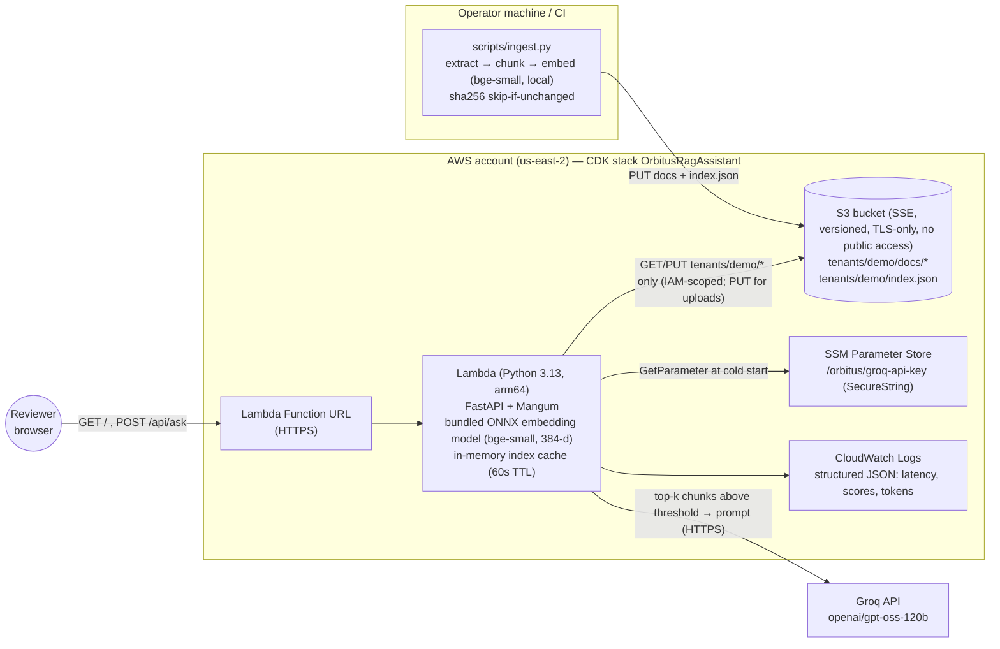
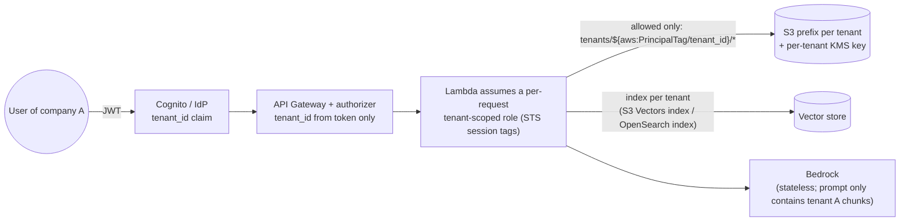

# Architecture

## Deployed components (implemented)

### Request flow (`POST /api/ask`)
1. Validate input (3–1000 chars) → 422 on failure.
2. Resolve tenant **server-side** (config today; auth token claim in future). Never from the request body.
3. Load the tenant's index from S3 (cached per Lambda container for 60 s).
4. Embed the question inside the Lambda → cosine top-k over that tenant's chunks only.
5. **Gate 1:** no chunk ≥ `MIN_SCORE` → return "not found" with no LLM call (saves cost, prevents hallucination).
6. The LLM (Groq) answers from the numbered passages with inline citations, or returns `NOT_FOUND` (**Gate 2**).
7. If the LLM fails, rate-limits or times out after retries → `status: degraded`, return the best passages verbatim instead of a 500.
8. Response contains the answer, source documents and pages, and all retrieved chunks with scores.

Bedrock (Titan + Claude Haiku 4.5) is implemented as an alternative provider and is the intended production choice (IAM auth, no secret, data stays in AWS). It is not used here because the AWS account is on the Free plan, which blocks Bedrock.

## Company isolation (proposed, not implemented)

| Layer | Boundary |
|---|---|
| Identity | `tenant_id` comes only from a verified token claim. Clients can never pass or override it. |
| Ingestion | Each ingestion job is started for one tenant and writes only under `tenants/{id}/`. Documents are stamped with `tenant_id`. |
| Storage | One S3 prefix per tenant, and one KMS key per tenant, so deleting a customer's data is a key deletion. The IAM policy uses `${aws:PrincipalTag/tenant_id}`, so even buggy code cannot read another prefix. Large or regulated tenants can get their own bucket or account. |
| Retrieval | One vector index per tenant (the physical boundary, as implemented now), not a shared index with a metadata filter that a single bug could drop. |
| Responses | The prompt contains only the chunks retrieved from the caller's own index. Bedrock doesn't keep prompts. Logs record the tenant ID, never document text. Response caches are keyed by tenant. |
| Verification | Automated cross-tenant tests: tenant A asks for tenant B's canary string and must get "not found". |
